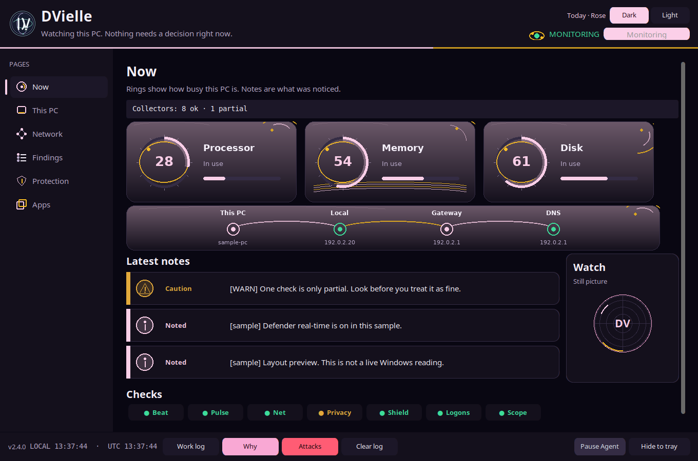
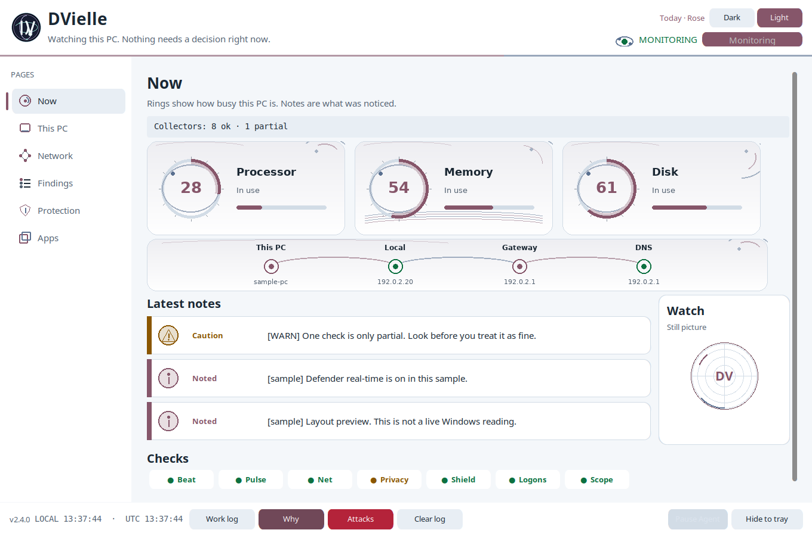

# DVielle — DEEP VIGILLANCE

[](LICENSE)
[](https://github.com/DVILLIE/VIGILLANCE/releases/latest)

DVielle is a free, local guardian for a Windows PC. It watches that computer, explains what it noticed in plain language, and shows options. It changes the PC only after you choose. A finding is a ticket: **Found → Fix → Resolved** (or still monitoring).

It is open source under the [MIT License](LICENSE). Package `dvielle` **2.4.0**.

<p>
  
</p>
<p>
  
</p>

The pictures above are the 2.4.0 console (Dark and Light) with labeled sample notes. A sample line is not a live Windows reading. On your PC the same window shows this computer’s measurements, and it says when a check is missing or only partial.

## Download

**[Download DVielle 2.4.0](https://github.com/DVILLIE/VIGILLANCE/releases/latest)**

| File | What it is |
|------|------------|
| [DVielle-2.4.0-windows-installer.zip](https://github.com/DVILLIE/VIGILLANCE/releases/download/v2.4.0/DVielle-2.4.0-windows-installer.zip) | Unzip, then run `installer\Install-DVielle.bat` as administrator |
| [DVielle-2.4.0-windows-source.zip](https://github.com/DVILLIE/VIGILLANCE/releases/download/v2.4.0/DVielle-2.4.0-windows-source.zip) | The same tree, named as source, if you want to read it before installing |
| GitHub source archive on the release | Created automatically from the `v2.4.0` tag |

There is **no standalone .exe**. This project does not ship a PyInstaller build. You need **Windows 10 or 11 (64-bit)** and **Python 3.12**. Steps are in [docs/USER_GUIDE.md](docs/USER_GUIDE.md) and in `installer/INSTALL.txt` inside the zip.

## What it does

On the PC where you install it, DVielle:

1. **Observes** — processor, memory, disk, network path, sign-in failures, privacy settings, and Windows security posture (including Defender, where Windows allows the read).
2. **Explains** — notes in ordinary language, with evidence behind **Why**. Unknown stays unknown. A partial check is labeled partial.
3. **Offers options** — when something looks wrong or unexpected, you get a choice.
4. **Acts after you choose** — close an app, change one supported setting, or open an unfamiliar folder in Windows Sandbox only when you picked that option and a second check agrees. If either check refuses, nothing is changed.

You can tell it an app or a setting is **OK to keep on**. While that still matches, it stays quiet. A mismatch can raise a note again. It still waits.

The background task runs at your logon. The console is a window on top of that task. Closing the window can hide it to the tray. Monitoring is the resident task, not the window.

## What it is not

- **Not an antivirus replacement.** It works with Microsoft Defender. It does not turn real-time protection off, and it does not add a Defender exclusion for its own folder.
- **Not an attack tool.** No exploit kits, no password capture, no scanning of other people’s machines. Scope is this PC.
- **Not a chat assistant.** The chat box was removed in 2.3.3 and is not coming back. See [docs/CHAT_REMOVED.md](docs/CHAT_REMOVED.md).
- **Limited by default, on purpose.** The resident scheduled task stays Limited (your normal rights). An always-elevated unattended task is not recommended.
- **Not a promise of a clean PC or a leakproof firewall.** It cannot prove the machine is free of threats. One blocked app is not proof that nothing can leave on every adapter. The written limits are [docs/CLAIMS.md](docs/CLAIMS.md).

It complements Windows security. It does not take Windows security’s place.

## Supported systems

| | |
|--|--|
| **Primary** | Windows 10 or Windows 11, 64-bit, on a laptop or desktop PC. Python 3.12. |
| **Limited / partial** | Linux and macOS can run shared keep-on logic only. Windows-only sensors stay unavailable: Defender, the firewall helper, the logon task, Windows Sandbox, and Windows sign-in events. There is no Linux or macOS installer. Do not treat those systems as a full DVielle product. Camera in-use detection on Windows is not available; Linux may only see device links, and no frames are stored. The footprint collector does not invent breach hits. |
| **Not this product** | A cloud server, a SaaS dashboard, or an install that watches some other machine. Put DVielle on the PC you want watched. The resident task is an interactive logon task. It does not cover the time before anyone logs on. See [docs/LAPTOP_ONLY.md](docs/LAPTOP_ONLY.md). |
| **Practical minimum** | A current Windows PC that can run Python 3.12 and the CustomTkinter window. No special GPU. |

Windows Home and Windows Pro are both in scope, with different features. Home does not get Windows Sandbox or App Control authoring. The console shows that instead of pretending the feature is there.

## How it works

- **Resident task + console.** `Install-DVielle.bat` registers one logon task named `DVielle` that runs the agent in the background. The desktop shortcut opens the native console, which attaches to that agent. A second launch does not start a second set of collectors.
- **Dual gate.** A change needs your selected option (or a published auto-protect case for that subject) **and** the decision check. Firewall rules, temp cleanup, startup changes, closing an app, and blocking an address all fail closed if either half says no. Closing an app is user-approved only, and it needs a fresh process identity.
- **Pillars.** Speed, storage, privacy, AI data leaving the PC, camera, online footprint, and protection. Each one is meant to end in a resolution you can see, not a warning with nowhere to go. What is actually shipped, and what is still unchecked, is [docs/FUNCTION_SPEC.md](docs/FUNCTION_SPEC.md) and [docs/CLAIMS.md](docs/CLAIMS.md).
- **Dark and Light.** Dark is the default. Light is the header control. The choice is stored in local `console_ui.json` and is not uploaded. The calendar day picks an accent pair. **Only the logo animates.**
- **Chat is gone.** Console speech for a close or a confirm stays local on Windows. It is not an assistant.

Pass and fail checks for those claims: [docs/TRUST_GATES.md](docs/TRUST_GATES.md). What the resident agent will and will not do on its own: [docs/AUTONOMY.md](docs/AUTONOMY.md).

## Install

Windows 10/11 and Python 3.12. From the unzipped release:

1. Run `installer\Install-DVielle.bat` **as administrator**.
2. The installer copies the tree to **`C:\DVILLIE`** (that path is the default in `installer\install-dvielle.ps1`), builds `C:\DVILLIE\.venv`, installs the dependencies from `pyproject.toml`, registers the Limited logon task, and checks that it started.
3. Open **DVielle - Deep Vigilance** on the desktop.

The folder you unzipped is only the source. GitHub may call it `VIGILLANCE-2.4.0` or `VIGILLANCE-main`. DVielle does not install itself into `C:\DVILLIE-main`. A custom destination is `installer\install-dvielle.ps1 -InstallDir 'C:\Apps\DVielle'` from an Administrator PowerShell window. Drive roots and shared Windows folders are rejected.

| Action | From the install folder (default `C:\DVILLIE`) |
|--------|--------------------------------------------------|
| Open the console | Desktop shortcut, `installer\Launch-DVielle.bat`, or `.venv\Scripts\pythonw.exe -m dvielle` |
| Headless monitoring | `.venv\Scripts\python.exe -m agent.main` |
| One observe-only pass | `.venv\Scripts\python.exe -m agent.main --once` |
| Stop the agent | `.venv\Scripts\python.exe -m agent.main --stop` |
| Uninstall | `installer\Uninstall-DVielle.bat` |

Day-to-day use, theme, note words, popups, privacy, and uninstall confirmation are in **[docs/USER_GUIDE.md](docs/USER_GUIDE.md)**.

Copying a new tree over an old install does not refresh `.venv`. Run the installer again.

## Privacy

Local-first. Notes, keep-on choices, and the theme file stay on this PC. Public-IP lookup is off unless you turn it on. Core monitoring does not call a model. DVielle does not upload its snapshot as part of normal use. Home and Pro diagnostic-data limits are explained in [docs/TELEMETRY_AND_HOME.md](docs/TELEMETRY_AND_HOME.md).

## Docs

| Doc | Purpose |
|-----|---------|
| [docs/USER_GUIDE.md](docs/USER_GUIDE.md) | Install, first open, theme, notes, uninstall |
| [docs/FUNCTION_SPEC.md](docs/FUNCTION_SPEC.md) | Pillars, what shipped, honesty limits |
| [docs/CLAIMS.md](docs/CLAIMS.md) | Promises, assumptions, and what stays unchecked |
| [docs/TRUST_GATES.md](docs/TRUST_GATES.md) | Pass/fail checks |
| [docs/AUTONOMY.md](docs/AUTONOMY.md) | What the resident agent does and does not do |
| [docs/LAPTOP_ONLY.md](docs/LAPTOP_ONLY.md) | Install on the PC, not in the cloud |
| [docs/TELEMETRY_AND_HOME.md](docs/TELEMETRY_AND_HOME.md) | Home and Pro telemetry honesty |
| [docs/CHAT_REMOVED.md](docs/CHAT_REMOVED.md) | Chat assistant removed in 2.3.3 |
| [docs/DECISIONS.md](docs/DECISIONS.md) | Product defaults |
| [docs/VIGILLANCE_MASTER_ARCHITECTURE.md](docs/VIGILLANCE_MASTER_ARCHITECTURE.md) | Architecture and gap map |

## Development checks

```bat
py -3.12 -m pip install -e ".[windows,dev]"
py -3.12 scripts\smoke_test.py
py -3.12 -m pytest -q
py -3.12 -m ruff check agent dvielle scripts/smoke_test.py --select E9,F63,F7,F82
```

A local drill that does not close real apps, block real networks, use a camera, or search for a person:

```bat
py -3.12 -m agent.exercise
```

See [docs/DEV.md](docs/DEV.md). Unit tests are not a substitute for a Windows install and a long run on a real PC.

## License and contact

MIT License. Copyright (c) 2026 Ravikant R. Tayade / KT Trading System. See [LICENSE](LICENSE).

Contact: kt.tradingsystem@gmail.com
